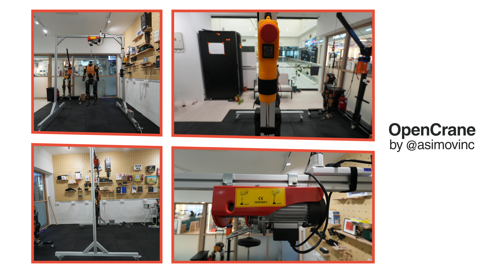

# OpenCrane, an open-source crane for humanoid robots

Built by [Menlo Research](https://menlo.inc) to assemble [Asimov](https://asimov.inc). We needed something portable and easy to modify. Nothing off the shelf gave us that, so we built it ourselves.

---

## Specs

| Parameter | Value |
|---|---|
| Height | 200 cm |
| Span | 180 cm |
| Lift capacity | 250 kg |
| Material | 6063-T5 aluminium extrusions (5050-10 profile) |
| Footprint | Foldable, portable |

---

## Materials

| Item | Qty |
|---|---|
| M8×50 Socket Head Bolt | 12 |
| M4-4545 Rhombus Nut | 12 |
| M12×60 Socket Head Bolt | 4 |
| 5050-10 End Cap | 6 |
| 5050-10 Profile 0.3 m (45° cuts) | 6 |
| 5050-10 Profile 1.5 m | 2 |
| 5050-10 Profile 1.8 m | 1 |
| 5050-10 Profile 2.0 m | 2 |
| 50 mm wheels with footlock | 4 |
| [Aiko Mini Electric Winch 250 kg](https://aikchinhin.sg/products/aiko-electric-winch-model-win-pa?variant=41701438750814) | 1 |

---

## Why extrusions

The 5050-10 aluminium extrusion profile has T-slots on every face. You can mount brackets, sensors, cable guides, or tooling anywhere on the frame without drilling. Reconfiguring takes minutes.

---

## Files

- `/bom` — material list

---

## License

GPL-3.0 license. Build it, modify it, share it.

---

Made by [Menlo Research](https://menlo.inc).

